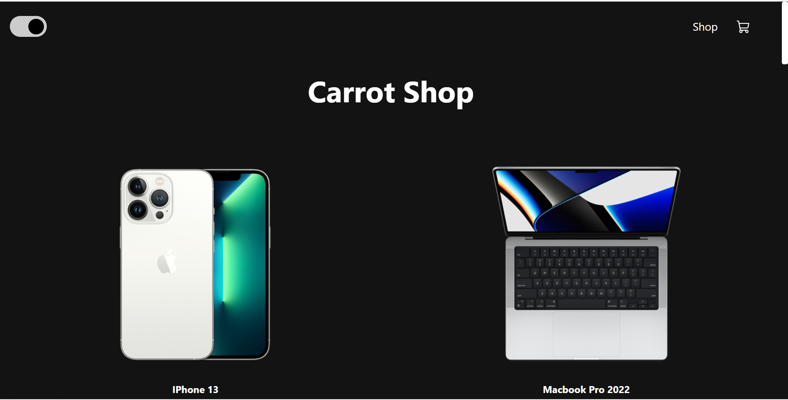
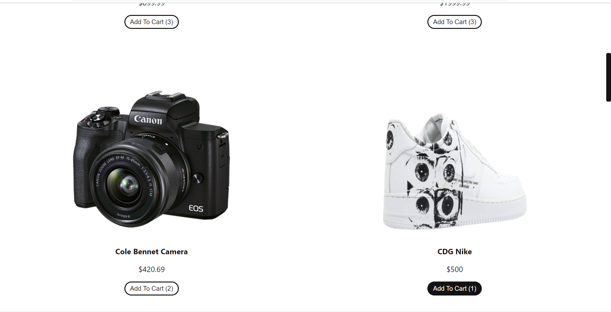
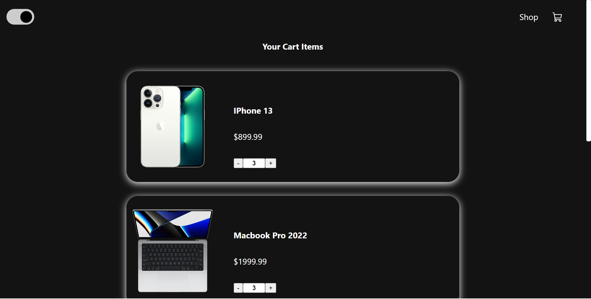
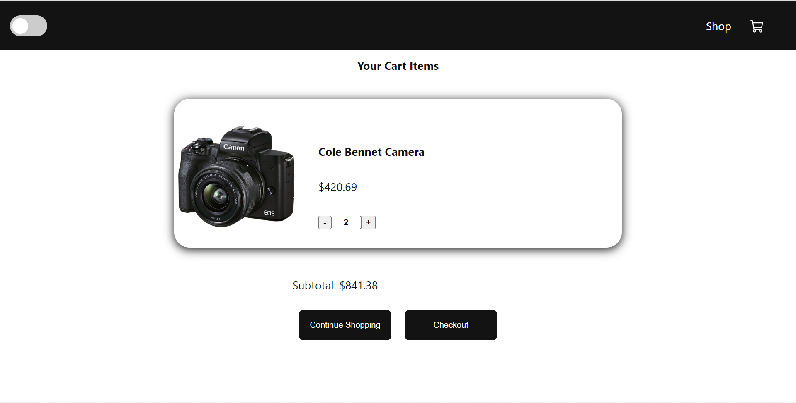

# React Store Website

This is a simple ecommerce website built in React. 

## Features
- Home Page <br/>
- Cart Page <br/>
- Add to Cart<br/>
- Dark Mode <br/>
- Scaled for all devices<br/>

## Installation
<details>
<summary>
  <code>There are several ways to save this repository on your device. Two of these options include:</code>
</summary>

- [Downloading repository as ZIP](https://github.com/carrot2803/Store-React/archive/refs/heads/master.zip)
- Running the following command in a terminal, provided the [GitHub CLI](https://cli.github.com/) has been previously installed:
```sh
git clone https://github.com/carrot2803/Store-React.git
```

<code>Install React and dependencies:  </code>

Run the following command to install the required dependencies:
```sh
npm i
```
Run the app: Connect your device or emulator, and run the following command to launch the app:
```sh
yarn start
```
</details>

## Contributing

Contributions are welcome.! If you have any ideas, suggestions, or bug reports, please create an issue or submit a pull request. You can also contact me at carrot#8856 on Discord.

## Snippets
<br/>
<br/>
<br/>
<br/>